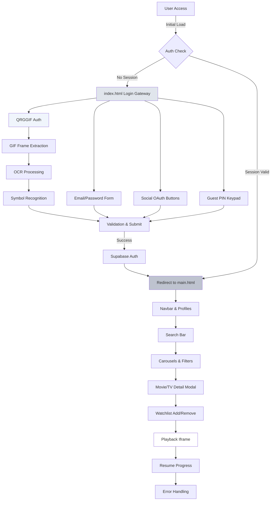
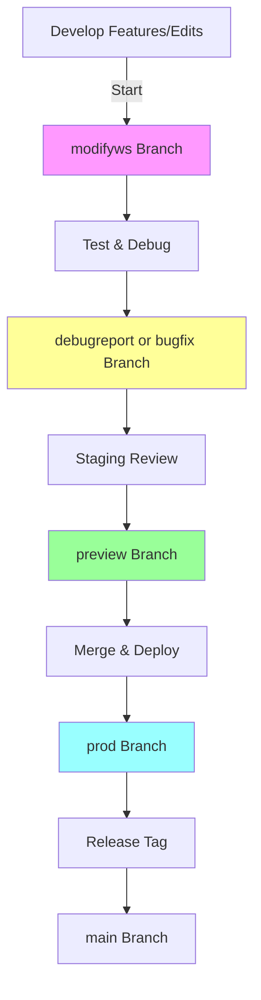

# Integrated Wayang Seni Pujangga Project

## Overview

This project integrates a neumorphic login gateway with the Wayang Seni Pujangga streaming website. The login form provides secure access (email/password, social OAuth, guest PIN) using Supabase backend, redirecting authenticated users to the streaming site. The streaming site features TMDB-powered content discovery, iframe-based playback, profile-based watchlists, and resume functionality—all client-side with localStorage persistence.

Created by Aigars Silkalns for Colorlib (original neumorphic design).  
Adjustment by ctaxnagomi: Added keypad for replacing "sign up" with "Guest" mode, using an array of valid 5-digit PINs controlled inside [`setup_guest_pins.sql`](setup_guest_pins.sql).  
Enhanced Documentation and Integration by Kilo Code.

The project is fully static (HTML/CSS/JS) with Supabase for auth/PIN validation, suitable for demo or production with proxying for API keys.

## Features

### Login Gateway (Neumorphic Form with QRGGIF Authentication)

- **QRGGIF Authentication**:
  - Advanced GIF parsing and frame extraction system
  - Tesseract OCR integration with custom symbol recognition
  - Interactive debug interface for processing visualization
  - Efficient cache management system for optimized performance
  - Export functionality for processing data analysis
  - Enhanced preprocessing for improved OCR accuracy
  
- **Neumorphic Design**: Soft UI with embossed/inset elements via multi-layered box-shadows.
- **Tactile Interactions**: Hover elevations, soft press effects, ambient mouse-responsive lighting.
- **Gentle Animations**: 0.3s transitions, error shake, success pulse + plasma (hue/glow keyframes).
- **SVG Icons**: Scalable icons for inputs (user, email, lock) and social (Google, GitHub, Twitter).
- **Monochromatic Palette**: #e0e5ec base, subtle shadows for cohesion.
- **Responsive**: Mobile-adapted (<480px) with flex layouts.
- **Multi Auth Modes**: Email/password login, QRGGIF auth, Guest PIN via keypad (validates 150 PINs from SQL).
- **Social OAuth**: Provider detection with Supabase integration stubs.
- **Validation**: Real-time (email regex, password ≥6 chars, PIN 5-digits, QRGGIF); ARIA-enhanced.
- **Backend**: Supabase for auth sessions, QRGGIF validation, and PIN RPC (validate_pin function).
- **ctaxnagomi Modification**: Guest keypad replaces signup; PIN array managed in setup_guest_pins.sql (creates table, inserts 150 codes, RPC for validation).

### Streaming Site (Wayang Seni Pujangga)

- **Content Discovery**: TMDB API integration for movies/TV search, genres, metadata fetching (posters, details, episodes).
- **Playback**: Embedded vidnest.fun iframes (splayer-movie.html, splayer-tvshow.html) with postMessage for seek/resume.
- **Watchlists & Profiles**: localStorage-based per-profile lists; add/remove movies/TV, progress tracking.
- **Responsive Carousels**: Infinite scroll for top-rated, upcoming, series (carousel.js).
- **Search & Filtering**: Real-time search, genre filters (search-player.js).
- **Resume Functionality**: Saves watch progress (>30s) on timeupdate; auto-resume/seek on reload.
- **Metadata Modals**: TMDB details on hover/click (cast, synopsis, ratings).
- **UI/UX**: Clean navbar (navbar.js), profile selection, loading spinners, error alerts.
- **Modular Code**: Separate JS modules (carousel.js, profile-watchlist.js, search-player.js); consolidated CSS.

### Integrated Flow

- Auth check on streaming load: Redirects to login if no Supabase session.
- Session Persistence: Shared across login/streaming via Supabase.
- Error Handling: Try-catch for APIs, user-friendly messages (e.g., offline iframe fallback).
- Accessibility: ARIA labels, keyboard nav, semantic HTML, lazy-loaded images/videos.
- Performance: Optimized shadows/transforms, delayed video loads, minification-ready.

## Project Structure

Top-level (Login Gateway):

- [`index.html`](index.html): Neumorphic form structure.
- [`style.css`](style.css): Neumorphic styles, animations.
- [`script.js`](script.js): NeumorphismForm class, validation, Supabase auth.
- [`setup_guest_pins.sql`](setup_guest_pins.sql): Supabase schema/RPC for PINs (ctaxnagomi).
- [`netlify.toml`](netlify.toml): Deployment config (redirects, headers).
- [`README.md`](README.md): This doc.
- [`PROGRESS_TRACKER.txt`](PROGRESS_TRACKER.txt): Development checklist.
- [`RELEASE_NOTES.md`](RELEASE_NOTES.md): Changelog.
- [`MANUAL.md`](MANUAL.md): Setup/usage guide.

Subdirectory (Streaming Site - v2.0.0 base):

- `wsp-assets/`
  - [`main.html`](wsp-assets/main.html): Entry point (auth check, navbar, carousels).
  - `css/`: [`style.css`](wsp-assets/css/style.css), [`search-player.css`](wsp-assets/css/search-player.css), etc.
  - `js/`: [`script.js`](wsp-assets/js/script.js), [`carousel.js`](wsp-assets/js/carousel.js), [`profile-watchlist.js`](wsp-assets/js/profile-watchlist.js), [`search-player.js`](wsp-assets/js/search-player.js), [`navbar.js`](wsp-assets/js/navbar.js).
  - `frontend/`: [`movie-detail.html`](wsp-assets/frontend/movie-detail.html), [`splayer-movie.html`](wsp-assets/frontend/splayer-movie.html), etc.
  - `images/`: Assets (posters, backgrounds, logo.svg).
  - `media/`: Video backgrounds.
  - [`Readme.md`](wsp-assets/Readme.md): Original streaming docs (supplemental).

No external dependencies beyond CDNs (FontAwesome, Google Fonts) and Supabase/TMDB APIs.

## Architecture Diagram

## Tech Stack and Tools

- **Frontend**: HTML5, CSS3, JavaScript (ES6+)
- **Styling**: Neumorphic design with vanilla CSS (box-shadows, transitions)
- **Backend & Auth**: Supabase (Authentication, PostgreSQL database, RPC functions for PIN validation)
- **APIs**: The Movie Database (TMDB) for movies/TV shows metadata, search, and posters
- **Deployment**: Netlify (static hosting, redirects via netlify.toml, automatic HTTPS)
- **IDE**: Visual Studio Code (VS Code) for development, debugging, and Live Server extension
- **AI Tools**:
  - Kilo Code: AI software engineer for code implementation, refactoring, documentation enhancement, and task automation
  - Grok-4 (xAI): Advanced reasoning model for problem-solving, code analysis, and mode-based workflows (e.g., Code, Architect, Debug modes)

## Git Workflow Diagram

## Installation & Usage

1. **Setup**:

   - Clone/download the project.
   - **Supabase**: Create project at supabase.com; run [`setup_guest_pins.sql`](setup_guest_pins.sql) in SQL Editor (enables UUID, creates guest_pins table with 150 PINs, RPC function). Note anon/authenticated keys for JS.
   - **TMDB**: Get API key from themoviedb.org; replace placeholder in search-player.js (prod: proxy via server).
   - No build required; open in browser or local server (VS Code Live Server).

2. **Running**:

   - **Login**: Open index.html; use email/password, social buttons, or Guest PIN (5-digits from SQL). Success redirects to streaming.
   - **Streaming**: On main.html (auto-redirect or direct): Select profile, search/filter, click for details/playback. Resume watches automatically.
   - **Guest Flow**: Keypad validates PIN via Supabase RPC; grants session without email.
   - **Interactions**: Hover for neumorphic effects; keyboard nav supported.

3. **Customization**:

   - **Login**: Edit palette/shadows in style.css; tweak validation in script.js; add PINs via SQL INSERT.
   - **Streaming**: Update TMDB key/endpoints in search-player.js; customize profiles/watchlist keys in profile-watchlist.js.
   - **Integration**: Modify redirect URL in script.js; extend Supabase for user tables.
   - **Dark Mode**: Add CSS media query (invert shadows).

4. **Browser Support**:

   - Full: Chrome 88+, Firefox 103+, Safari 15.4+, Edge 88+.
   - Requires: Fetch API, localStorage, postMessage; fallbacks for older.

## Security Considerations

- **QRGGIF Authentication**: 
  - Implement rate limiting for QRGGIF uploads and processing
  - Add validation for GIF file size and frame count
  - Secure OCR processing against injection attacks
  - Implement encrypted storage for cached QRGGIF data
  - Monitor and log unusual OCR processing patterns
  
- **API Keys**: TMDB key exposed in JS (placeholder: b9571479231e6a103f8f10a0b2525d63)—rotate immediately and proxy via backend (e.g., Node/Supabase Edge Functions) in production.
- **Supabase**: Anon key allows PIN queries (RPC secure); use Row Level Security (RLS) for tables. Rotate keys; enable email confirmations.
- **PINs**: 150 hardcoded 5-digit codes in SQL—queryable by anon; for prod, use one-time/use or user-specific PINs.
- **Iframes**: vidnest.fun external—risk of downtime/blocks; add sandbox attributes, error fallbacks.
- **localStorage**: Client-side watchlists/progress—not synced; vulnerable to tampering (use Supabase for persistence in prod).
- **HTTPS**: Enforce in deployment (Netlify auto); avoid local testing for auth.
- **Recommendations**: 
  - Server-side proxy for all APIs
  - CAPTCHA for login attempts
  - Audit Supabase policies
  - Implement secure file upload for QRGGIF processing
  - Add anomaly detection for OCR patterns

## Deployment Instructions

1. **Static Hosting (Netlify Recommended)**:

   - Drag entire project folder to netlify.com/drop (or git connect repo).
   - netlify.toml auto-applies: Redirects (e.g., /* to index.html for SPA feel), security headers (CSP, HSTS).
   - Publish dir: Root (includes subdirectory); functions: None (static).

2. **Supabase Config**:

   - Update JS with your project URL/anon key.
   - Run setup_guest_pins.sql; grant anon EXECUTE on RPC.

3. **Custom Domain/Prod**:

   - Add env vars for keys (Netlify: Site Settings > Environment).
   - Proxy APIs: Deploy Edge Function for TMDB (hide key).
   - Minify: Use Vite/Webpack for JS/CSS bundling.
   - Monitoring: Netlify Analytics; Supabase logs for auth.

4. **Testing Deploy**:

   - Local: Live Server + ngrok for Supabase webhooks.
   - Verify: Auth flow, search/playback, session persistence.

For full prod: Migrate to server-rendered auth, database-synced watchlists.

## Release Notes

See [`RELEASE_NOTES.md`](RELEASE_NOTES.md) for version history (current: v2.18.0), changes, known issues.

## Manual

Detailed setup, usage, troubleshooting in [`MANUAL.md`](MANUAL.md) (covers Supabase, TMDB, flows).

## Progression Tracker

Development checklist in [`PROGRESS_TRACKER.txt`](PROGRESS_TRACKER.txt).

## Design Philosophy

- **Neumorphism**: Soft realism with shadows for depth, minimal colors.
- **Integration**: Seamless auth-to-content flow; modular for extensibility.
- **User-Centric**: Tactile login, intuitive streaming (search, resume, profiles).

## Accessibility Considerations

- **Contrast/Focus**: WCAG AA; visible outlines, ARIA-describedby.
- **Keyboard/Screen Readers**: Tab-navigable; semantic forms/modals.
- **Enhancements**: Alt texts on images; role="alert" for errors. Test with WAVE/VoiceOver.

## Performance Notes

- **Optimized**: GPU-accelerated CSS; async fetches; lazy media.
- **Bundle**: ~20KB total (minifiable); no heavy libs.
- **Tips**: Compress images; CDN for assets; Lighthouse target 90+.

## Limitations & Future Work

- **Limitations**: Client-side auth (no server validation); external deps (iframes/APIs); basic TV episodes.
- **Accessibility**: AAA potential with more testing.
- **Dark Mode**: Implement via CSS vars.
- **Backend**: Full Supabase users/watchlists; real streaming (no iframes).
- **Testing**: Add Jest/Cypress suites.
- **Enhancements**: Recommendations from PROGRESS_TRACKER.txt (e.g., synced progress).

## License

MIT License. Original by Colorlib; adjustments open-source.

## Contributing

Fork/PR for features (e.g., dark mode, API proxy). Issues for bugs (e.g., mobile carousels). Reference ctaxnagomi's PIN mod for similar.
